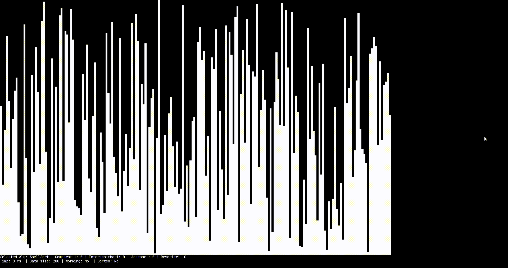

# SortingVisualizer

A Visualizer for a series of sorting algorithms I studied during my Data Structures and Algorithms course. Decided to build this application after reviewing a paper I wrote during the Methods and Practices in Computer Science course I followed back in my first year as a student.
The visualizer also gives a series of parameters that describe the performance of the algorithms (number of swaps, compares, reads, writes and the actual time). 

## Implemented Algorithms and Controls
* Insertion Sort (I)
* Selection Sort (S)
* Bubble Sort (D)
* Merge Sort (M)
* Quick Sort (Q)
* Radix Sort (R)
* Shaker Sort (K)
* Shell Sort (J)
* Along side the mentioned algorithms, a method for shuffling the elements was added (A). Arrow keys can be used to switch between the algorithms.

## To Do 
*  Save the data generated by testing the algorithms and generate benchmarks
*  Add GUI components to make the using experience more intuitive.
*  Add a Pause/Unpause while the algorithm is running.

## Example Use

